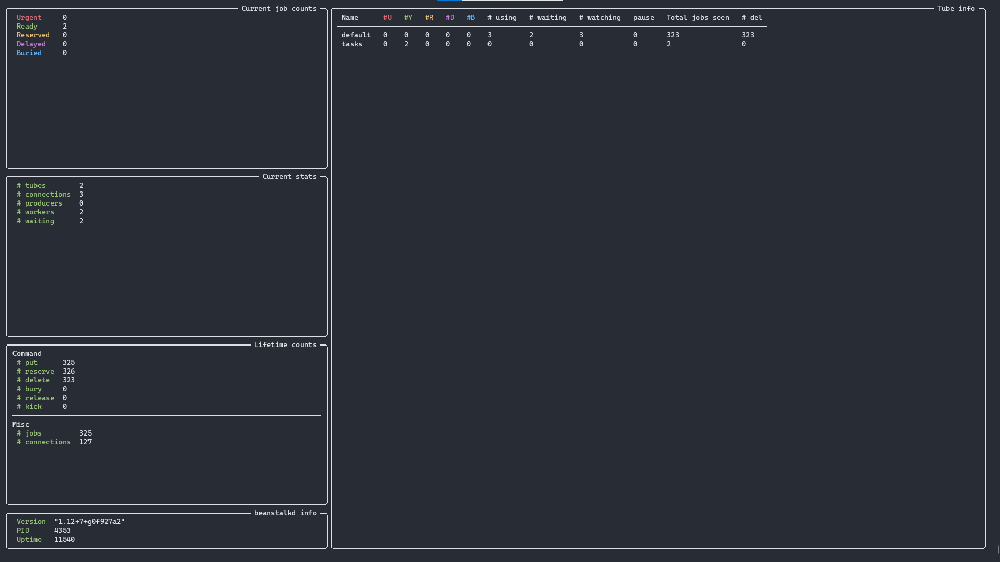

# Beanstalkd monitoring dashboard



A dashboard for monitoring a beanstalkd instance. Written in Python with [Rich](https://github.com/willmcgugan/rich) and [greenstalk](https://github.com/justinmayhew/greenstalk).

Installing requirements:
```
pip install -r requirements.txt
```

Running the dashboard:
```
python main.py
```

By default, the dashboard tries to connect to an instance at `localhost:11300`. Use the flags `--server` and `--port` to set the address to connect to.

The dashboard currently doesn't list all stats, just maybe the more useful ones.
